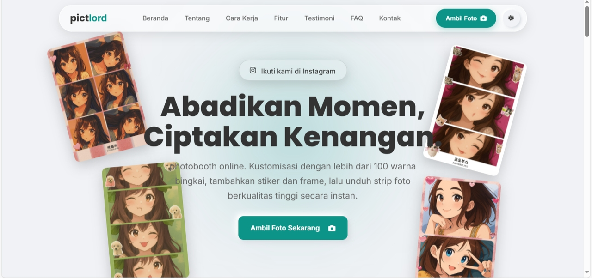

# Pictlord - Photobooth Online



**Pictlord** adalah aplikasi photobooth online gratis yang memungkinkan Anda mengambil foto instan bergaya photobooth kapan saja dan di mana saja. Kustomisasi foto Anda dengan ratusan warna bingkai, tambahkan stiker dan filter, lalu unduh strip foto berkualitas tinggi secara instan tanpa perlu registrasi.

**Kunjungi Situs Web: [Pictlord.web.id](https://www.pictlord.web.id/)**

---

## 📸 Fitur Utama

-   **Photobooth Instan**: Ambil 4 foto langsung dari webcam Anda.
-   **Kustomisasi Tanpa Batas**:
    -   Pilih dari **ratusan warna bingkai** menggunakan color picker.
    -   Hiasi dengan berbagai **stiker** lucu dan tematik.
    -   Terapkan **filter** untuk memberikan nuansa yang berbeda pada foto Anda.
-   **Berbagai Pilihan Layout**: Atur foto Anda dalam berbagai format strip yang tersedia.
-   **Tanpa Registrasi**: Langsung gunakan tanpa perlu membuat akun atau login.
-   **Unduh Kualitas Tinggi**: Simpan hasil karya Anda dalam format gambar berkualitas tinggi.
-   **Responsif**: Berfungsi dengan baik di desktop, tablet, dan perangkat seluler.
-   **Komunitas & Testimoni**: Bagikan hasil photobooth Anda dan lihat karya orang lain di bagian testimoni.
-   **Tema Terang & Gelap**: Sesuaikan tampilan antarmuka sesuai preferensi Anda.

---

## 💻 Teknologi yang Digunakan

Proyek ini dibangun menggunakan teknologi web modern, dengan fokus pada performa dan kemudahan penggunaan tanpa backend tradisional yang kompleks.

-   **Frontend**:
    -   HTML5
    -   CSS3
    -   JavaScript (Vanilla JS)
-   **Backend & Layanan Eksternal**:
    -   **Firebase Realtime Database**: Digunakan untuk menyimpan data testimoni dan komentar secara real-time.
    -   **GitHub API**: Digunakan secara kreatif sebagai layanan penyimpanan untuk gambar yang diunggah oleh pengguna di bagian testimoni.
-   **Library**:
    -   [AOS (Animate On Scroll)](https://michalsnik.github.io/aos/) untuk animasi saat menggulir halaman.

---

## 🚀 Cara Menggunakan

1.  Buka situs web [Pictlord.web.id](https://www.pictlord.web.id/).
2.  Klik tombol **"Ambil Foto Sekarang"**.
3.  Izinkan akses ke kamera Anda.
4.  Ambil empat pose terbaik Anda.
5.  Setelah selesai, Anda akan diarahkan ke halaman editor.
6.  Kreasikan foto Anda:
    -   Ganti warna bingkai.
    -   Tambahkan stiker.
    -   Pilih filter.
7.  Klik tombol **"Unduh"** untuk menyimpan hasilnya.

---

## 🛠️ Menjalankan Secara Lokal (Untuk Pengembang)

Anda dapat menjalankan proyek ini secara lokal untuk tujuan pengembangan atau kontribusi.

**Opsi 1: Buka Langsung File HTML**

Karena ini adalah proyek frontend statis, cara termudah adalah dengan membuka file `index.html` langsung di browser Anda.

**Opsi 2: Menggunakan Live Server**

Untuk pengalaman pengembangan yang lebih baik (dengan fitur seperti hot-reloading), Anda bisa menggunakan ekstensi **Live Server** di Visual Studio Code atau server pengembangan lokal lainnya.

1.  Clone repositori ini:
    ```bash
    git clone
    ```
2.  Buka folder proyek di editor kode Anda.
3.  Klik kanan pada file `index.html` dan pilih "Open with Live Server".

**Konfigurasi Tambahan:**

Fitur testimoni dan unggah gambar tidak akan berfungsi secara lokal tanpa konfigurasi. Anda perlu membuat akun Firebase dan token GitHub Anda sendiri.

1.  **Firebase**:
    -   Buat proyek baru di [Firebase Console](https://console.firebase.google.com/).
    -   Dapatkan objek konfigurasi `firebaseConfig` Anda.
    -   Ganti konten di `fire.js` dengan konfigurasi Anda.
2.  **GitHub**:
    -   Buat *Personal Access Token* (Classic) di [GitHub](https://github.com/settings/tokens) dengan izin `repo`.
    -   Buat repositori baru untuk menyimpan gambar.
    -   Ganti konten di `image.github.js` dengan token, nama pengguna, dan nama repositori Anda.

> **Penting**: File-file ini di-obfuscate dalam repositori. Anda perlu memformat ulang file `fire.js` dan `image.github.js` agar terlihat seperti ini sebelum memasukkan kredensial Anda:
>
> ```javascript
> // fire.js
> const firebaseConfig = {
>   apiKey: "...",
>   authDomain: "...",
>   databaseURL: "...",
>   projectId: "...",
>   storageBucket: "...",
>   messagingSenderId: "...",
>   appId: "...",
> };
> ```
>
> ```javascript
> // image.github.js
> const githubConfig = {
>   token: "ghp_...",
>   owner: "your-github-username",
>   repo: "your-repo-name",
>   path: "uploads", // atau folder pilihan Anda
> };
> ```

---

## 📂 Struktur Proyek

```
.
├── assets/             # Gambar, ikon, stiker, dan frame
├── css/                # File CSS
├── js/                 # File JavaScript
├── index.html          # Halaman utama (Single Page Application)
├── canvas.html         # Halaman untuk sesi photobooth
├── customize.html      # Halaman untuk mengedit foto
└── README.md           # Anda sedang membacanya
```

---

## 🤝 Kontribusi

Kontribusi, isu, dan permintaan fitur sangat diterima! Jangan ragu untuk membuka isu baru atau mengirimkan pull request.

---

## 📄 Lisensi

Proyek ini dilisensikan di bawah [MIT License](LICENSE).
